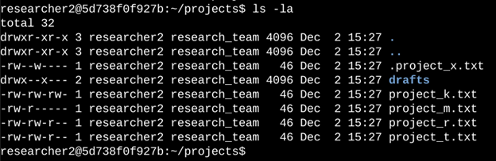
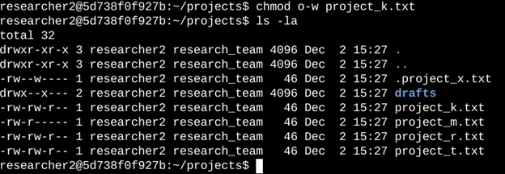
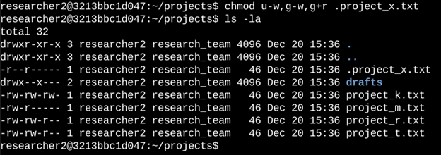
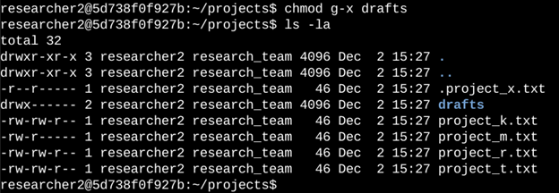

# Project 5: Managing File Permissions in Linux

## Project Overview
As a security professional supporting a research team, I reviewed and updated file and directory permissions in the `/home/researcher2/projects` directory to ensure proper authorization and enhance system security.  

This involved:
- Checking current permissions (including hidden files)
- Interpreting the 10-character permission string
- Removing unauthorized write access
- Securing a hidden archived file
- Restricting access to a sensitive subdirectory

All actions were performed using Linux terminal commands — real command executions and outputs are shown below via screenshots.

## Step-by-step Actions

### 1. Check File and Directory Details
**Goal**: List all files, hidden files, and their current permissions in the `projects` directory.

**Brief explanation**:  
Used `ls -la` to display detailed listing including hidden files (starting with `.`).  
The output revealed five regular files, one hidden file (`.project_x.txt`), and one subdirectory (`drafts`).

### 2. Describe a Permission String (Example)
**Goal**: Explain how to read the 10-character permission string.

(Using project_t.txt as example: `-rw-rw-r--`)

**Brief explanation**:  
- 1st character (`-`): regular file (not directory)  
- 2–4: user permissions → read & write (`rw-`)  
- 5–7: group permissions → read & write (`rw-`)  
- 8–10: other permissions → read only (`r--`)  

This format helps quickly determine who can read, modify, or execute files/directories.

### 3. Remove Write Permission for Others (project_k.txt)
**Goal**: Ensure no other users can write to any project files (organization policy).

<!-- INSERT YOUR SCREENSHOT HERE -->
<!-- Show `chmod` command + follow-up `ls -la` to verify change -->

**Brief explanation**:  
Used `chmod o-w project_k.txt` to remove write permission from others, then verified with `ls -la`.

### 4. Secure Hidden Archived File (.project_x.txt)
**Goal**: Remove write access for everyone, keep read access for user and group only.

<!-- INSERT YOUR SCREENSHOT HERE -->
<!-- Show combined chmod command + verification -->

**Brief explanation**:  
Used symbolic mode:  
`chmod u-w,g-w,g+r .project_x.txt`  
→ removed write from user & group, added read to group if missing  
Then confirmed updated permissions.

### 5. Restrict Access to drafts Directory
**Goal**: Allow only the owner (researcher2) to access the `drafts` directory and its contents.

<!-- INSERT YOUR SCREENSHOT HERE -->
<!-- Show chmod command + final ls -la verification -->

**Brief explanation**:  
Used `chmod go-x drafts` to remove execute permission from group and others (removing traverse/enter ability).  
Owner already had full access, so no change needed there.

## Summary
I examined existing permissions using `ls -la`, interpreted the 10-character strings, and applied targeted changes with `chmod` to:
- Eliminate unauthorized write access
- Secure an archived hidden file
- Restrict directory access to only the intended owner

**Main skills demonstrated**:
- Reading and understanding Linux file permissions
- Using `ls -la` for detailed inspection (including hidden files)
- Applying symbolic `chmod` to precisely modify permissions
- Enforcing least privilege principle in file system security

These techniques are essential for securing Linux-based systems, managing authorization, and maintaining compliance in cybersecurity operations.

Questions / feedback welcome!
