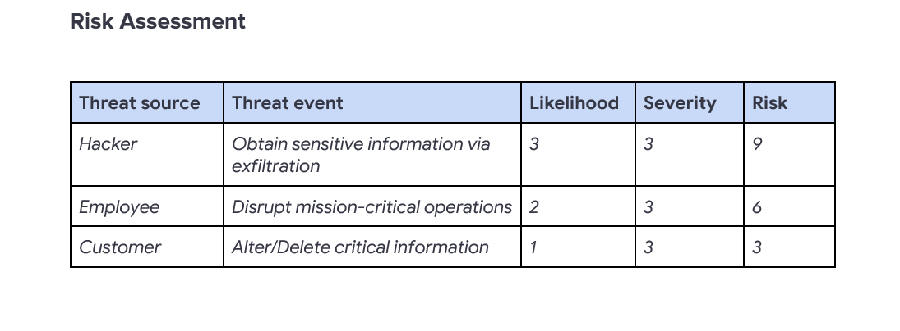

# Project 5: Vulnerability Assessment of a Publicly Accessible Database Server

## Project Overview
In this project, I conducted a qualitative vulnerability assessment for an e-commerce company with a publicly accessible database server. The goal was to identify security risks associated with open access to sensitive business data and evaluate the potential impact on business operations.
This assessment follows **NIST SP 800-30 Rev. 1** guidelines to identify threats, evaluate likelihood and impact, calculate risks, and recommend practical remediation steps.

## Risk Assessment

I identified three realistic threat scenarios based on the server's public exposure and business criticality.

**Key risks calculated** (Likelihood × Severity = Risk):
- Hacker → Obtain sensitive information via exfiltration → **Risk: 9** (High)
- Employee → Disrupt mission-critical operations → **Risk: 6** (Moderate-High)
- Customer → Alter/Delete critical information → **Risk: 3** (Moderate)

## Approach
The server’s public accessibility dramatically increases the attack surface, making it vulnerable to skilled external actors (hackers), insider threats (employees), and opportunistic misuse (customers).  

These threats were selected because they align with common real-world attack patterns against exposed databases — ranging from data theft to operational sabotage  and could result in severe financial, reputational, and legal consequences for the business.

## Remediation Strategy

To reduce or eliminate these risks, I recommend the following prioritized security controls:

- Enforce **principle of least privilege** and **role-based access control (RBAC)** to limit who can connect and what they can do.
- Require **multi-factor authentication (MFA)** and strong credential policies for all users.
- Replace outdated SSL with modern **TLS encryption** for data in transit.
- Implement **IP allow-listing** (whitelisting) to restrict access to trusted corporate/VPN IPs only.
- Apply **defense-in-depth**: firewall hardening, network segmentation, intrusion detection, and routine vulnerability scanning.

These measures would close the primary exposure while maintaining necessary remote access for business operations.

## Summary & Skills Demonstrated
This assessment demonstrated how a simple configuration mistake (public database exposure) can lead to catastrophic business risks.  

By systematically applying NIST SP 800-30 Rev. 1, I identified high-impact threats, scored them qualitatively, and proposed targeted, realistic fixes.

**Key skills shown**:
- Structured risk assessment using NIST frameworks
- Threat modeling for exposed systems
- Qualitative risk scoring (likelihood × severity)
- Translating technical vulnerabilities into business-impact language
- Developing actionable remediation plans

These competencies are essential for vulnerability management, risk analysis, and security consulting roles.
