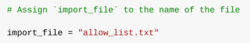
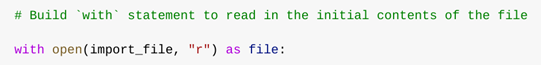
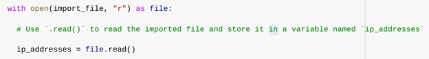
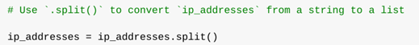
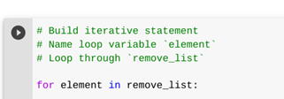
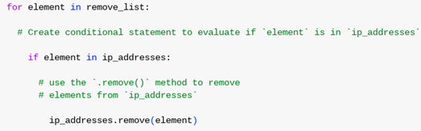
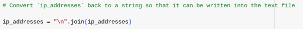
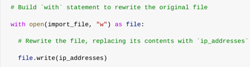

# Project 6: Python Algorithm to Update an IP Allow List for Access Control

## Project Overview
As a security professional at a healthcare organization, I developed a Python algorithm to automate the secure management of an IP allow list.This project was completed as part of the **Google Cybersecurity Certificate** program and reflects hands-on security

The allow list (`allow_list.txt`) controls which IP addresses can access restricted content (e.g., patient records). A separate `remove_list` identifies IPs that must be revoked (e.g., former employees or compromised addresses).

The algorithm:
- Opens and reads the allow list file
- Converts contents to a list
- Removes any IPs found on the remove list
- Writes the updated list back to the file

This automation ensures timely revocation of access, reduces manual error, and supports least-privilege principles in access control.

## Step-by-Step Algorithm Execution

All screenshots below show real terminal output from the Python script (code + results).

### 1. Open the Allow List File
**Goal**: Safely open `allow_list.txt` in read mode.

**Explanation**:  
Used `with open(import_file, "r") as file:` to open the file securely (auto-closes when done).  
This is best practice for resource management in file operations.

### 2. Read File Contents into a String
**Goal**: Load the entire file content as a string.

**Explanation**:  
Applied `.read()` method to convert file contents to string → stored in `ip_addresses`.

### 3. Convert String to List
**Goal**: Split IP addresses into a list for easy manipulation.

<!-- INSERT YOUR SCREENSHOT HERE -->

**Explanation**:  
Used `.split()` (default whitespace delimiter) to turn the string into a list of individual IP addresses.

### 4. Iterate Through Remove List
**Goal**: Check each IP in `remove_list` against the allow list.

**Explanation**:  
`for element in remove_list:` loop iterates over IPs to be removed.

### 5. Remove IPs Found in Both Lists
**Goal**: Safely remove matching IPs from allow list.

**Explanation**:  
`if element in ip_addresses:` check prevents errors → then `ip_addresses.remove(element)`.  
Works safely here because there are no duplicate IPs in the list.

### 6. Update File with Revised Allow List
**Goal**: Write updated list back to `allow_list.txt`.

**Explanation**:  
- `.join("\n")` converts list back to string with new lines  
- `with open(import_file, "w") as file:` opens in write mode (overwrites file)  
- `.write(ip_addresses_str)` updates the file with the cleaned allow list

## Summary & Skills Demonstrated
This Python script automates a critical security task: revoking IP-based access privileges efficiently and reliably.

**Key skills shown**:
- File I/O operations (`open()`, `.read()`, `.write()`) with proper context management (`with` statement)
- String → List → String conversion (`.split()`, `.join()`)
- List manipulation and safe element removal (`.remove()` with conditional check)
- Building simple, error-resistant automation scripts
- Applying least-privilege and access control concepts through code

These are foundational skills for security automation, SOAR (Security Orchestration, Automation and Response), and scripting in cybersecurity roles.

